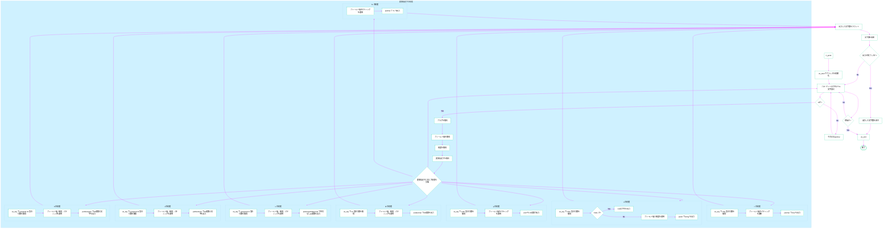

# FT

```mermaid


%%{
  init: {
    'theme': 'base',
    'themeVariables': {
      'primaryColor': '#fff',
      'primaryTextColor': '#000',
      'primaryBorderColor': '#06cc8a',
      'lineColor': '#f0f',
      'secondaryColor': '#ccf',
      'tertiaryColor': '#cff1ff',
      'tertiaryTextColor': 'f0f'
    }
  }
}%%

flowchart TD
    Start(ft_printf)
    InitVarArgs[va_start でアドレスを初期化]
    ReadChar[フォーマット文字列から1文字読む]
    IsPercent{%か?}
    
    IsNotPercent[そのままputchar]
    
    subgraph ConversionHandler [変換指定子の処理]
        GetFlags[フラグを取得]
        GetWidth[フィールド幅を取得]  
        GetPrecision[精度を取得]
        GetConvSpec[変換指定子を取得]
        
        ConvDispatch{変換指定子に応じて処理を分岐}
        
        ConvDispatch-->HandleCharSub
        ConvDispatch-->HandleStringSub
        ConvDispatch-->HandlePointerSub
        ConvDispatch-->HandleDecimalSub
        ConvDispatch-->HandleUnsignedSub
        ConvDispatch-->HandleHexLowerSub
        ConvDispatch-->HandleHexUpperSub
        ConvDispatch-->HandlePercentSub
    end

subgraph HandleCharSub [c の処理]
    GetCharArg[va_arg で char 型の引数を取得]
    ApplyWidthPadding[フィールド幅のパディングを適用]
    PrintChar[putchar でchar を出力]
     GetCharArg-->ApplyWidthPadding-->PrintChar
end

subgraph HandleStringSub [s の処理]
    GetStringArg[va_arg で char* 型の引数を取得]
    StrNullCheck{NULL か?}
    PrintNullStr[null文字列を出力]
    ApplyWidthPrecision[フィールド幅と精度を適用]
    PrintString[putstr でstring を出力]
    GetStringArg-->StrNullCheck
    StrNullCheck--Yes-->PrintNullStr
    StrNullCheck--Noo-->ApplyWidthPrecision-->PrintString
end

subgraph HandlePointerSub [p の処理]
    GetPointerArg[va_arg で void* 型の引数を取得]
    ApplyWidthPadding2[フィールド幅のパディングを適用]
    PrintPointerHex[void* を16進数で出力]
    GetPointerArg-->ApplyWidthPadding2-->PrintPointerHex
end

subgraph HandleDecimalSub [di の処理]
    GetIntArg[va_arg で int 型の引数を取得]
    ApplyWidthPrecisionPadding[フィールド幅、精度、パディングを適用]
    PrintDecimal[putdecimal で10進数を出力]
    GetIntArg-->ApplyWidthPrecisionPadding-->PrintDecimal
end

subgraph HandleUnsignedSub [u の処理]
    GetUnsignedArg[va_arg で unsigned int 型の引数を取得]
    ApplyWidthPrecisionPadding2[フィールド幅、精度、パディングを適用]
    PrintUnsignedDecimal[putunsigneddecimal で符号なし10進数を出力]
    GetUnsignedArg-->ApplyWidthPrecisionPadding2-->PrintUnsignedDecimal
end

subgraph HandleHexLowerSub [x の処理]
    GetUnsignedArg2[va_arg で unsigned int 型の引数を取得]
    ApplyWidthPrecisionPadding3[フィールド幅、精度、パディングを適用]
    PrintHexLower[puthexlower で16進数小文字を出力]
    GetUnsignedArg2-->ApplyWidthPrecisionPadding3-->PrintHexLower
end

subgraph HandleHexUpperSub [X の処理]
    GetUnsignedArg3[va_arg で unsigned int 型の引数を取得] 
    ApplyWidthPrecisionPadding4[フィールド幅、精度、パディングを適用]
    PrintHexUpper[puthexupper で16進数大文字を出力]
    GetUnsignedArg3-->ApplyWidthPrecisionPadding4-->PrintHexUpper
end

subgraph HandlePercentSub [% の処理]
    ApplyWidthPadding3[フィールド幅のパディングを適用]
    PrintPercent[putchar で % を出力]
    ApplyWidthPadding3-->PrintPercent
end

HandleCharSub-->IncrementCharCount
HandleStringSub-->IncrementCharCount
HandlePointerSub-->IncrementCharCount
HandleDecimalSub-->IncrementCharCount
HandleUnsignedSub-->IncrementCharCount
HandleHexLowerSub-->IncrementCharCount
HandleHexUpperSub-->IncrementCharCount 
HandlePercentSub-->IncrementCharCount

IncrementCharCount[出力した文字数をカウント]

UpdateCharCount[文字数を更新]

IsOutputEnd{出力が終了したか?}

IsOutputEnd--Yes-->ReturnCharCount[出力した文字数を返す]
IsOutputEnd--Noo-->ReadChar

ReturnCharCount[出力した文字数を返す]

IncrementCharCount-->UpdateCharCount-->IsOutputEnd

ReturnCharCount[出力した文字数を返す]-->CleanUpVarArgs[va_end]-->End([終了])
    
    IsEnd{終端か?}
    CleanUpVarArgs[va_end]
    
    Start-->InitVarArgs-->ReadChar
    ReadChar-->IsPercent
    IsPercent--Yes-->GetFlags-->GetWidth-->GetPrecision-->GetConvSpec-->ConvDispatch
    ConvDispatch---->ReadChar
    IsPercent--Noo-->IsNotPercent-->ReadChar
    ReadChar-->IsEnd
    IsEnd--Yes-->CleanUpVarArgs
    IsEnd--Noo-->ReadChar

```
